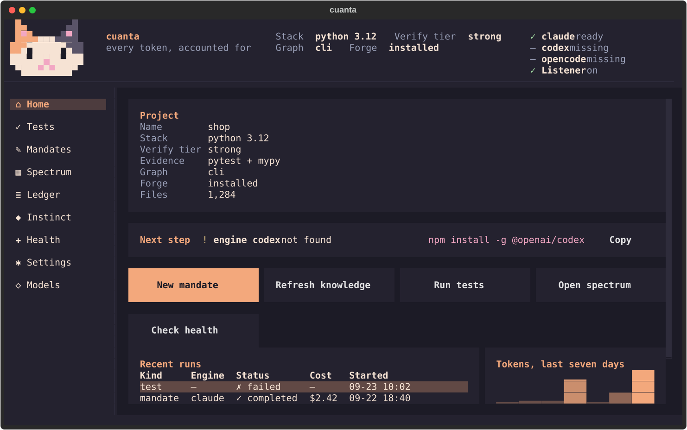
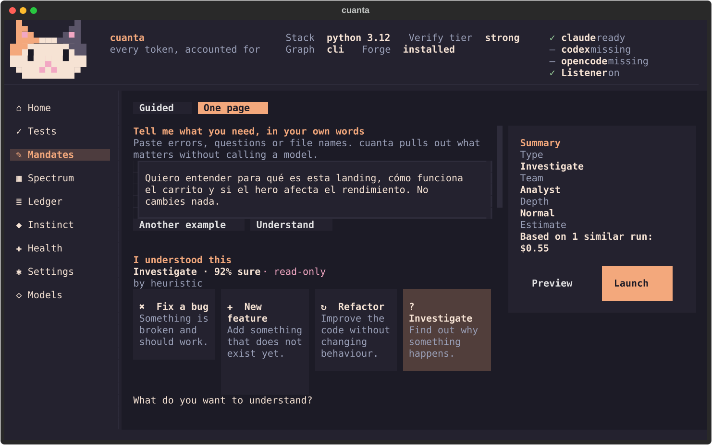
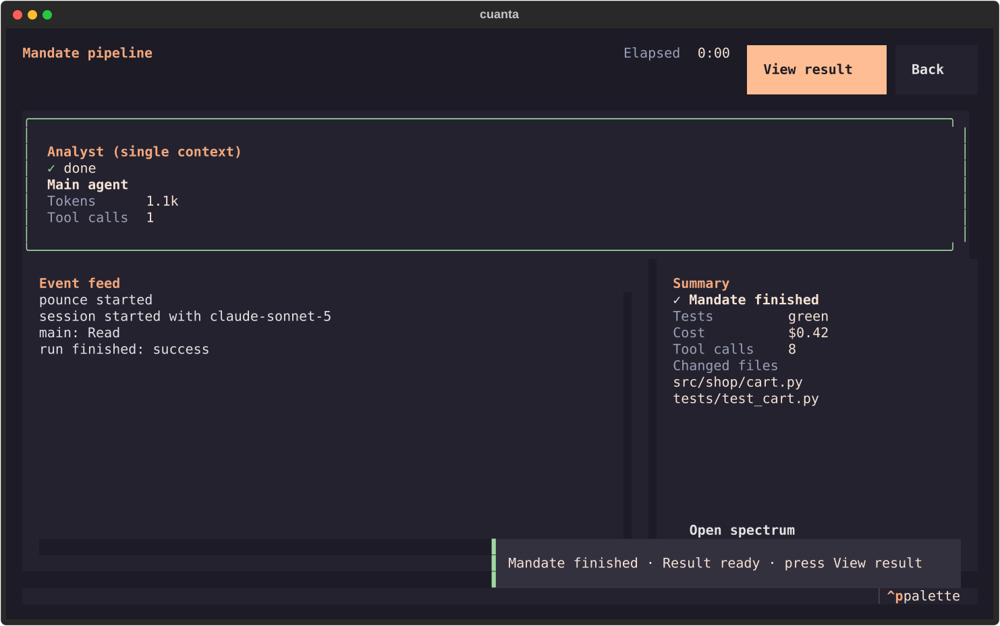
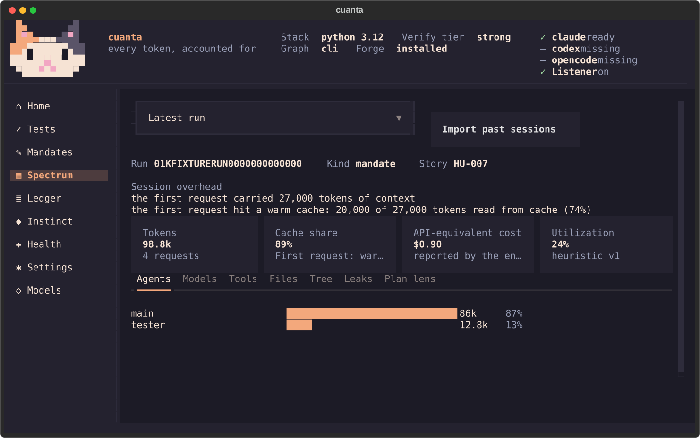
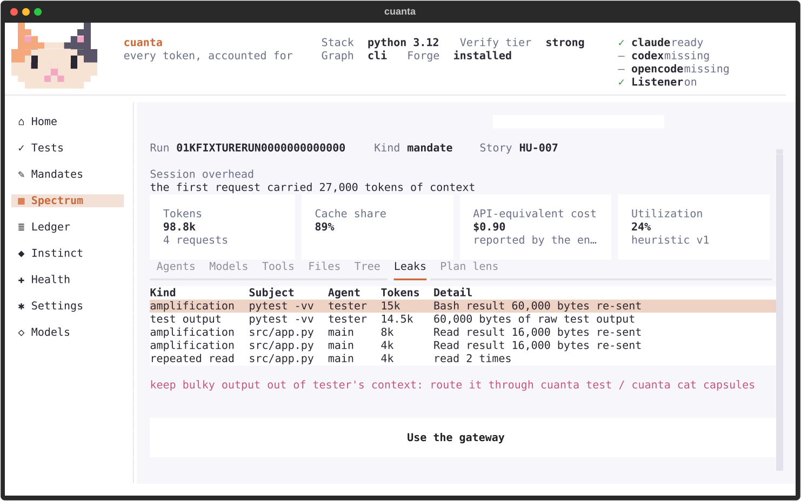
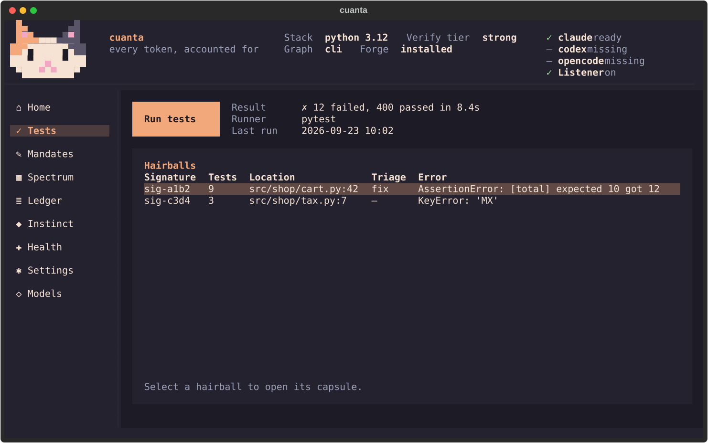
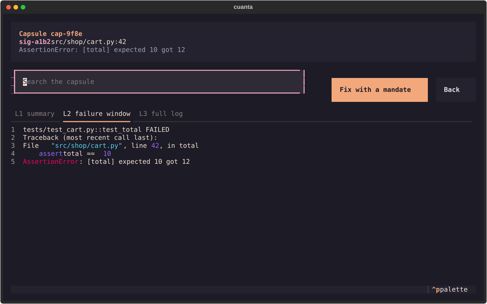
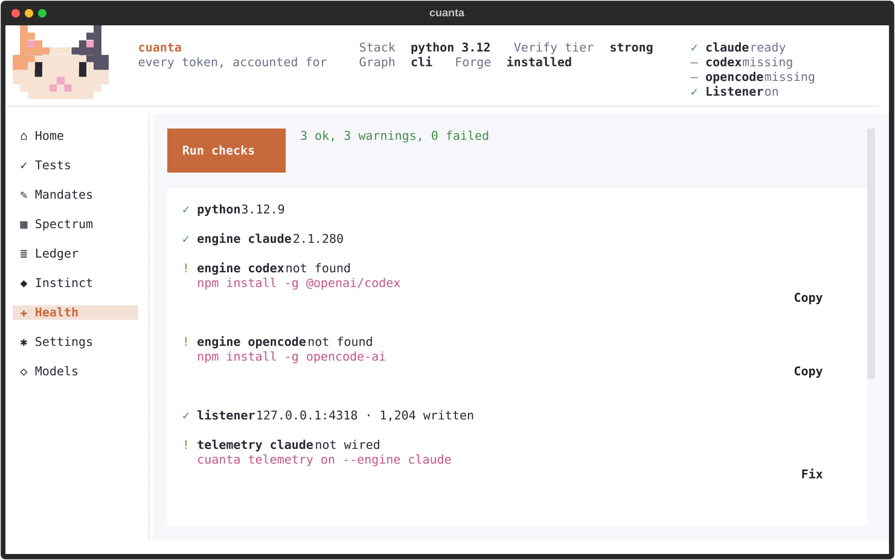
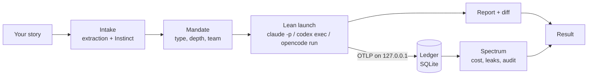
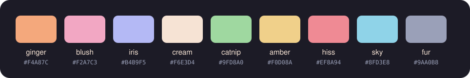

<div align="center">

<picture>
  <source media="(prefers-color-scheme: dark)" srcset="docs/assets/banner-dark.svg">
  <source media="(prefers-color-scheme: light)" srcset="docs/assets/banner-light.svg">
  
</picture>

<p>
  <a href="https://github.com/oscarvasquezroncal/cuanta/actions/workflows/ci.yml"></a>
  
  
  
  
</p>

**See where every token goes. Then spend fewer of them.**

cuanta is a local companion for **Claude Code**, **Codex** and **OpenCode**.
It measures what your coding agents spend, explains why, and runs them in a leaner way.

[Why](#why-cuanta) ·
[What's inside](#whats-inside) ·
[Install](#install) ·
[Quick start](#quick-start) ·
[How it works](#how-it-works) ·
[Commands](#commands) ·
[Privacy](#privacy-and-safety) ·
[Contributing](#contributing)

</div>

---

## Why cuanta

Coding agents are wonderful, and expensive in ways you can't see.

- **Every turn resends the whole conversation.** A 16 KB test log read early in a long session is paid again on every request that follows.
- **Sessions start heavy.** Plugins, MCP servers and hooks can add tens of thousands of tokens before your request is even read.
- **Pipelines pay twice.** An orchestrator and its subagents each pay their own start-up context, and the orchestrator re-reads what they return.
- **None of it shows up as a line item.** You see a total, not the reason.

cuanta makes each of those visible, and then removes what it can.

### Field notes from a real project

These are single runs on one production Next.js landing page (Windows 11, Claude Code 2.1.28x, Sonnet 5). They illustrate the problem; the [benchmark](#benchmark) is the reproducible version.

| What we measured | Before | With cuanta |
|---|---|---|
| Context before the first answer, with the user's plugins, MCP servers and hooks loaded | 53,109 tokens. The answer came from injected memory, and zero files were read | Lean sessions start without user plugins, hooks or MCP servers |
| Read-only audit of the site | $0.545 and 239 s with an orchestrator plus an analyst | $0.43 and 113 s in a single context: 21% cheaper, about half the time |
| Fixed context vs. the actual request, first request of that audit | — | 41,505 fixed tokens vs. 413 for the request. This was measured before limiting built-in tool definitions; the later A/B result is in [external contracts](docs/CONTRACTS.md) |

---

## What's inside

| Module | What it does |
|---|---|
| **Spectrum** | A token map of every run: per agent, model, tool and file. Session overhead, start-up timing, cache share, planned vs. actual models, and leaks (amplification, repeated reads, raw test output, compactions). |
| **Mandates** | Tell it what you need in your own words. cuanta extracts the questions, errors and scope, classifies the task, and launches the right shape: a single read-only context for investigations, or a Forge pipeline (analyst → senior → tester → docs) for fixes and features. |
| **Depth and routing** | Quick, Normal or Deep sets the effort, the model tiers and a hard spend cap, plus a turn limit for Claude Code mandates. Each role gets a tier (economy → premium). cuanta maps tiers to the models you actually have, then audits what really ran. |
| **Lean sessions** | Runs launched by cuanta start without your plugins, hooks and MCP servers, from byte-identical settings files, so the prompt prefix can be cached. |
| **Gateway** | `cuanta test` runs your suite once, clusters failures by signature and stores full logs as capsules. Agents get one line per failure and page into details only when they need to. |
| **Results and ledger** | Launched runs store reports and file snapshots under `.cuanta/runs/`; costs and telemetry live in the local SQLite ledger. Results show diffs, and ledger data exports to CSV or JSON. |
| **Instinct** | Fast, typed decisions (choice, score, yes/no) for classification and routing. An offline heuristic by default, or [TypeSafe's Jev](https://typesafe.ai) when you connect a key. |
| **Forge** | Ships [claude-agent-forge](https://github.com/oscarvasquezroncal/claude-agent-forge) v0.4: a project rulebook (`CLAUDE.md`), four agents and a mandate template, generated for your repo by `cuanta init`. |
| **The app** | A mouse-friendly terminal app, built on [Textual](https://textual.textualize.io), in English and Spanish, with a web mode. Everything also works as plain commands with `--json`. |
| **Bench** | Reproducible runs with hidden acceptance tests: a plain agent vs. cuanta vs. cuanta with routing. |

### A look around

<table>
  <tr>
    <td width="50%"><b>Home</b><br></td>
    <td width="50%"><b>A new mandate</b><br></td>
  </tr>
  <tr>
    <td><b>A run in progress</b><br></td>
    <td><b>Spectrum</b><br></td>
  </tr>
  <tr>
    <td><b>Leaks, with one-click fixes</b><br></td>
    <td><b>Tests clustered into signatures</b><br></td>
  </tr>
  <tr>
    <td><b>Capsules: logs by level</b><br></td>
    <td><b>Health</b><br></td>
  </tr>
</table>

More screens: [light theme](docs/screenshots/home-light.svg),
[ledger](docs/screenshots/ledger.svg), [init](docs/screenshots/init.svg),
[consent](docs/screenshots/consent.svg) and [diff](docs/screenshots/diff.svg).

---

## Install

**1. Install [uv](https://docs.astral.sh/uv/).** It also provides Python 3.12+ for you.

```bash
# Windows (PowerShell)
powershell -ExecutionPolicy ByPass -c "irm https://astral.sh/uv/install.ps1 | iex"

# macOS / Linux
curl -LsSf https://astral.sh/uv/install.sh | sh
```

**2. Have at least one engine installed and signed in:**
- [Claude Code](https://docs.claude.com/en/docs/claude-code/overview)
- [Codex CLI](https://github.com/openai/codex)
- [OpenCode](https://opencode.ai)

**3. Install cuanta from a source checkout, in the folder containing `pyproject.toml`:**

```bash
uv tool install .
cuanta meow
```

For web mode, use `uv tool install . --with textual-serve`. A PyPI release is planned.

**Optional extras:**
- [graphify](https://github.com/Graphify-Labs/graphify) for a code graph agents can query instead of reading files.
- A TypeSafe key in `TYPESAFE_API_KEY` to make Instinct use Jev.

> [!TIP]
> On Windows, use **Windows Terminal** for mouse support and full colour. cuanta detects the legacy console and falls back to a keyboard-first theme.

---

## Quick start

```bash
cd path/to/your/project

cuanta doctor              # what's installed, what's missing, one fix per issue
cuanta spectrum --import   # free: see what your past Claude Code sessions cost
cuanta init --dry-run      # preview what init will do
cuanta init                # detect the stack, wire local telemetry (asks first), set up Forge
cuanta                     # open the app
```

In the app, open **Mandates** and write what you need. For example:

> Audit this landing page: what it's for, how the cart and checkout work, whether the physics hero hurts performance, and its SEO and accessibility risks. Don't change anything.

cuanta shows what it understood (type, questions, scope), the team and the estimated cost, and after the run a report with `file:line` evidence.

The same thing as a command:

```bash
cuanta mandate --type investigation \
  --what "Explain how checkout works" \
  --why "Which files handle the cart? Is the payment adapter wired?" \
  --out-of-scope "No code changes" \
  --depth quick
```

> [!NOTE]
> `cuanta init` runs Forge through your engine to write the rulebook and agents. On 100–260-file projects it cost about $1.5–2.5 in our runs. `--dry-run` shows the plan first, and `--skip-forge` skips it.

---

## How it works



1. **Intake.** A deterministic extractor pulls questions, error lines, file mentions and out-of-scope phrases from your text, at zero tokens. Instinct classifies the task type, the depth and what's missing, in one batched call.
2. **Mandate.** cuanta fills your project's mandate template, picks the shape (single context or pipeline), plans a model tier per role and applies the spend cap. You can preview the exact prompt and command before launching.
3. **Lean launch.** The engine CLI runs headless:
   - on Claude Code, with lean settings, per-agent models (`--agents`) for pipelines, effort (`--effort`) and the analyst's instructions (`--append-system-prompt`) for single investigations;
   - on Codex and OpenCode, with one model per run;
   - with built-in write tools denied for investigations.
4. **Telemetry.** Engines report to a local OTLP listener on `127.0.0.1`, and past sessions can be imported from transcripts. Everything lands in `.cuanta/ledger.db`.
5. **Result.** The report, the files that changed, the consumption, and a check of planned vs. actual models.

**Every mandate is a fresh session.** Continuity comes from what's written down, not from chat history: the report's NEXT STEP (the **Continue** button fills the next mandate with it), Forge's docs, and the stored results.

<details>
<summary><b>Key ideas</b></summary>

- **Amplification.** A tool result's tokens times the requests that resend it before the next compaction. A log read at turn 10 of a 60-turn session is paid about 50 times.
- **Session overhead.** The first request's tokens minus your request: system prompt, tools, rulebook, anything injected.
- **Single context vs. pipeline.** Investigations run as one read-only context, with no orchestrator re-reading a subagent's output. Fixes and features use the Forge pipeline.
- **Capsules.** Long outputs are stored once and paged by level: L0 one line, L1 a summary, L2 the relevant window, L3 the full text.
- **Signatures.** Failures normalized (numbers, paths and ids stripped) and hashed, so 40 failing tests with one cause read as one line.
- **Utilization Index.** A heuristic (v1) for how much of what was processed contributed to the result. It's labelled as a heuristic everywhere it appears.

</details>

<details>
<summary><b>Depth and model routing</b></summary>

| Depth | Effort | Spend cap for investigations |
|---|---|---|
| Quick | low | $0.25 |
| Normal | medium | $0.60 |
| Deep | high | $1.50 |

| Role | Default tier | Example models |
|---|---|---|
| Orchestrator | standard | Sonnet 5 · GPT-5.6 Terra |
| Analyst | standard | Sonnet 5 · GPT-5.6 Terra |
| Senior | premium | Opus 5.5 · GPT-5.6 Sol |
| Tester | premium | Opus 5.5 · GPT-5.6 Sol |
| Docs | economy | Haiku 4.5 · GPT-5.6 Luna |

- **The tiers** ship in `src/cuanta/assets/model_tiers.toml`, and you can change them in the **Models** screen.
- **cuanta only picks models your engines report as available.** It never goes above the caps you set.
- **Frontier models are opt-in.**
- **After each run, the audit** compares the planned model with the one the telemetry saw.
- **Claude turn limits** follow the selected depth. `cuanta mandate --max-turns` or `CUANTA_MAX_TURNS` overrides the depth limit; `--no-cap` removes only the spend cap.

</details>

<details>
<summary><b>Engine support</b></summary>

| | Claude Code | Codex CLI | OpenCode |
|---|---|---|---|
| Launch, report, ledger | ✓ | ✓ | ✓ |
| Live telemetry | OTLP | OTLP, after `cuanta telemetry on --engine codex` | JSON event stream |
| Per-agent models | ✓ via `--agents` | single model per run | single model per run |
| Lean sessions | ✓ | — | — |
| Import past sessions | ✓ | ✓ | — |

`--cross-engine` (experimental) runs each pipeline role in its own session on the engine its routing picks, passing a JSON handoff between roles.

Engine flags, telemetry fields, pricing rows and their verification status are tracked in [`docs/CONTRACTS.md`](docs/CONTRACTS.md).

</details>

<details>
<summary><b>Architecture</b></summary>

Hexagonal, with a functional core:

- `src/cuanta/domain/` is pure: no I/O.
- `src/cuanta/ports/` defines the protocols.
- `src/cuanta/application/` holds the use cases.
- `src/cuanta/adapters/` talks to engines, storage, telemetry, graph and system.
- `src/cuanta/cli/` and `src/cuanta/tui/` present.
- `src/cuanta/bootstrap.py` wires everything together.

The dependency rule is enforced by `tests/architecture/test_layers.py`.

</details>

---

## Commands

Use `--help` on any command. Global `--plain` and `--json` control CLI output; `ui` opens the app.

| Command | What it does |
|---|---|
| `cuanta` / `cuanta ui` | Open the app. `cuanta ui --web` serves it in the browser; `cuanta ui --lang es\|en` sets the language |
| `cuanta doctor` (`purr`) | Health check, with one fix per issue |
| `cuanta init` | Detect, graph, telemetry, Forge, verify. `--dry-run`, `--skip-forge` |
| `cuanta refresh` | Refresh Forge's knowledge, reindex the graph, report tier drift |
| `cuanta mandate` (`pounce`) | Compose and run a mandate. `--type`, `--what`, `--why`, `--out-of-scope`, `--depth`, `--shape`, `--max-turns` for Claude, `--dry-run` |
| `cuanta route --dry-run` | Show the routing plan for a request |
| `cuanta runs list \| show \| open` | Stored runs and their reports |
| `cuanta test` | Gateway: one run, failures clustered into signatures |
| `cuanta cat <capsule>` | Page through a stored log by level or line range |
| `cuanta spectrum [run]` | Token map, leaks and session overhead. `--import` reads past sessions |
| `cuanta ledger export` | CSV or JSON export |
| `cuanta listen` | Local OTLP collector: `--background`, `--status`, `--stop` |
| `cuanta telemetry on \| off \| status \| env` | Wire each engine's telemetry, with backups |
| `cuanta instinct show \| use \| probe` | Configure Instinct. `cuanta instinct use NAME --global` sets the user-wide default |
| `cuanta models` | The model catalog and its tiers |
| `cuanta bench run \| report` | The reproducible benchmark |
| `cuanta probe cache-ttl` | Measure Claude's prompt-cache window with capped runs in a temporary project. Preview without spend; `--yes` runs it, `--long` adds a later check |
| `cuanta loop` | A guarded fix loop, only where verification is strong |
| `cuanta meow` | Michi, the palette and the version |

<details>
<summary><b>Configuration and environment</b></summary>

- **Project settings** live in `.cuanta/config.toml`.
- **User-wide settings** live in your user config folder (for example, `cuanta instinct use jev --global` writes there).
- **Project settings win** over user-wide ones.

```toml
[runs]
session = "lean"            # lean | full

[ui]
language = "es"             # es | en
mandate_layout = "guided"   # guided | one_page

[listener]
port = 4318
```

| Variable | Purpose |
|---|---|
| `CUANTA_BUDGET_USD` | Default spend cap for launched runs |
| `CUANTA_MAX_TURNS` | Claude mandate turn limit override; zero uses the depth limit |
| `CUANTA_ENGINE` | Default engine |
| `CUANTA_INSTINCT` | Instinct backend: heuristic, jev or llm |
| `CUANTA_LANG` | App language |
| `CUANTA_TERMINAL` | Force `modern` or `legacy` terminal handling |
| `CUANTA_SHELL` | Force the shell used for printed hints |
| `CUANTA_NO_ANIMATION` | Keep Michi still |
| `TYPESAFE_API_KEY` | Jev key, for Instinct |
| `TYPESAFE_BASE_URL` | A different Jev endpoint, such as OpenRouter's System One API |
| `TYPESAFE_API_BASE` | Fallback Jev endpoint when `TYPESAFE_BASE_URL` is absent |

The default cache probe saves a conservative warm lower bound. Add `--long` to check for a later
cold result; a usable measurement is saved with its authentication mode, engine version, model
and date in the user config. [External contracts](docs/CONTRACTS.md) distinguishes observed
cache behavior from unverified modes. The Home and Team window estimates expiry for the last
observed Claude prefix; it does not guarantee that a different next mandate will reuse it.

The full list lives in [`docs/FLAGS.md`](docs/FLAGS.md).

</details>

---

## Privacy and safety

- **Local first.** The ledger, reports and capsules live in `.cuanta/` inside your project, which is git-ignored. The telemetry listener only binds to `127.0.0.1`.
- **Authentication and local config.** Engine runs use the official CLIs' sign-in. For Jev, cuanta reads `TYPESAFE_API_KEY` from the environment and sends it as a bearer token. It also reads Claude settings `env` values for routing; telemetry setup backs up existing engine config locally, so protect those backups as you would the originals.
- **Consent before config changes.** Wiring telemetry edits an engine's config only after you agree, and keeps a backup. `cuanta telemetry off` restores it.
- **Prompts are not stored by default.** Reports are, because they're your deliverable.
- **Instinct is offline by default.** With Jev, it sends the redacted request text and, only if you enable it, file paths and symbol names. It never sends code, and **See what is sent** shows the exact payload.
- **Investigations deny built-in write tools.** cuanta never runs git in your projects.

---

## Benchmark

`cuanta bench` runs a fixed set of tasks under three conditions:

1. a plain headless agent;
2. cuanta's mandate flow;
3. cuanta with routing.

The rules:
- **Hidden acceptance tests** are copied in only after each run, so the agent never sees them.
- **Every run** starts from a fresh copy of the repo, with pinned versions, a spend cap and randomized order.
- **The report** shows medians and ranges, never a single hand-picked run.

<!-- cuanta-bench:start -->
_Results will appear here after the first public run of `cuanta bench report --readme`._
<!-- cuanta-bench:end -->

---

## Project status and roadmap

**0.2.0, beta.**
- **Tested daily** on Windows 11 with Claude Code 2.1.28x; CI is configured for Linux and macOS.
- **Codex and OpenCode** support is newer and less exercised.

**Next up:**
- **A semantic change index.** A local index built from the code graph, the AST, your rulebooks and past findings: handling cards per file, search without exploration, change plans with protected paths, and MCP tools for agents. The target is the same audit at $0.30 or less.
- **Sandbox runs.** Try a mandate in an isolated copy, then apply the patch yourself.
- **Projects and workspaces.** One app for many projects, including multi-folder ones (backend plus frontend).
- **Cost anatomy and read efficiency** for every run.

---

## Contributing

From the repository root:

```bash
uv sync --extra web
uv run ruff check .
uv run ruff format --check .
uv run mypy --strict
uv run pytest -n auto --cov --cov-report=term
```

House rules, enforced by tests:
- The hexagonal layers.
- `mypy --strict`.
- No comments or docstrings in `src/` and `tests/`: names and tests carry the meaning.
- Every visible string in both the English and Spanish catalogs.
- Snapshot tests for every screen.

Commits follow [Conventional Commits](https://www.conventionalcommits.org). See [CONTRIBUTING.md](CONTRIBUTING.md) for the full workflow.

### The palette



Michi, the calico cat, keeps the books. *Cuánta* is Spanish for "how much".

---

<div align="center">

MIT licensed. See [LICENSE](LICENSE).

cuanta is an independent project. It is not affiliated with Anthropic, OpenAI or the OpenCode project; their product names belong to their owners.

</div>
